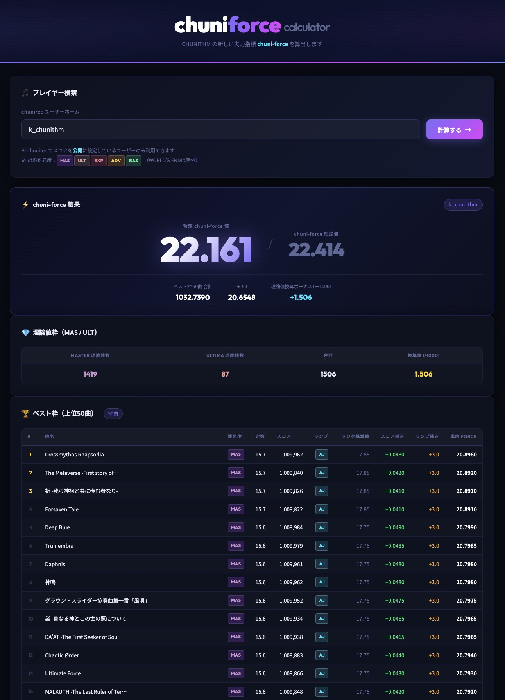

# chuni-force-calculator 要件定義書

## 1. システム概要

### 1.1 システム名
**chuni-force-calculator**

### 1.2 目的・背景
本システムは、音楽ゲーム「CHUNITHM」において、既存のレート計算とは異なる新しい実力指標「**chuni-force**」を算出・表示するWebアプリケーションである。

chuni-forceとは、SOUND VOLTEX の「VOLTFORCE」に着想を得た、プレイヤーの実力を数値化する指標である。従来のレートとは異なる計算式を用いることで、新たな角度からプレイヤーの実力を可視化する。

### 1.3 動作環境
- **ホスティング**：GitHub Pages（静的ファイルのみで動作）
- **実行環境**：モダンWebブラウザ（Chrome / Firefox / Safari / Edge 最新版）
- **言語**：HTML / CSS / JavaScript（フロントエンドのみ、サーバーサイド処理なし）

---

## 2. 対象ユーザー

- CHUNITHMをプレイしており、**chunirec** にスコアを**公開状態**で登録しているユーザー

---

## 3. 機能要件

### 3.1 ユーザー入力

| 要素 | 仕様 |
|---|---|
| ユーザーネーム入力フィールド | chunirecで使用しているユーザーネームをテキスト入力する |
| 計算ボタン | クリックするとデータ取得・計算処理を開始する |

### 3.2 chunirec API連携

- **処理タイミング**：計算ボタンが押されたとき
- **通信方法**：JavaScript（Fetch API）によるHTTPリクエスト
- **取得対象**：入力されたユーザーネームをキーとして、そのユーザーのスコアデータを取得する
- **使用エンドポイント**：[chunirec API v2.0 `records/showall`](https://developer.chunirec.net/docs/v2.0/methods-records)
  → `https://api.chunirec.net/2.0/records/showall.json?token={APIトークン}&region=jp2&user={ユーザーネーム}`
- **取得難易度**：**MASTER（MAS）・ULTIMA（ULT）・EXPERT（EXP）・ADVANCED（ADV）・BASIC（BAS）** の5難易度
  ※ WORLD'S ENDなどの特殊難易度は対象外とする
- **APIトークン**：`255e414dcb7295f135eca9cabb890b85ad651fedc2148026491cd7044f847406e11e01cb366885f8deadaf4d259edbab5151a798b8888d6f13b6cd5805dec8b9`（ユーザー k_chunithm のトークン）
- **`const`フィールドの扱い**：`is_const_unknown: true`であっても値をそのまま利用するが、譜面定数の正確な値は reiwa.f5.si から取得した値を優先する

---

## 4. chuni-force 計算ロジック

### 4.1 最終計算式

```
chuni-force = (ベスト枠50曲の単曲chuni-force値の合計 ÷ 50) + (MAS & ULT の理論値総数 ÷ 1000)
```

ユーザーの実際のスコアに基づく値と、全曲理論値（1,010,000点）を仮定した場合の値（chuni-force理論値）の両方を算出する。

---

### 4.2 単曲 chuni-force 値の計算

各楽曲の単曲chuni-force 値は以下の計算で求める。

```
単曲chuni-force値 = 譜面定数 + スコア補正値 + ランプ補正値
```

説明の簡略化のため、(譜面定数 + スコア補正値)を**レーティング値**と呼ぶことにする。

**譜面定数の取得優先順位：**

1. `reiwa.f5.si`（`chunirec_all.json`）から曲名で検索した `const` 値
2. chunirec API の `const` フィールド（`is_const_unknown: true` でも使用）
3. chunirec API の `level` フィールド（保険用フォールバック）

> chunirec APIの `const` は精度が低い場合があるため、reiwa.f5.si の値を最優先とする。

---

### 4.3 スコア補正値

スコアに応じて「譜面定数」を元にレーティング値を算出する。
各ランク境界値を基準に、10点または15点ごとに一定量加算される。

| ランク | スコア区間 | レーティング値 |
|---|---|---|
| SSS+ | 1,010,000（理論値） | 譜面定数 + 2.25 |
| SSS+ | 1,010,000 〜 1,009,000 | 1点ごとに +0.0001（加算） |
| SSS+ | 1,009,000 | 譜面定数 + 2.15 |
| SSS | 1,009,000 〜 1,007,500 | 1点ごとに +0.0001 |
| SSS | 1,007,500 | 譜面定数 + 2.0 |
| SS+ | 1,007,500 〜 1,005,000 | 1点ごとに +0.0002 |
| SS+ | 1,005,000 | 譜面定数 + 1.5 |
| SS | 1,005,000 〜 1,000,000 | 1点ごとに +0.0001 |
| SS | 1,000,000 | 譜面定数 + 1.0 |
| S+ | 1,000,000 〜 990,000 | 10点ごとに +0.0004 |
| S+ | 990,000 | 譜面定数 + 0.6 |
| S | 990,000 〜 975,000 | 10点ごとに +0.0004 |
| S | 975,000 | 譜面定数（+0） |
| AAA | 975,000 〜 950,000 | 15点ごとに +0.001 |
| AAA | 950,000 | 譜面定数 − 1.67 |
| AA | 950,000 〜 925,000 | 15点ごとに +0.001 |
| AA | 925,000 | 譜面定数 − 3.34 |
| A | 925,000 〜 900,000 | 15点ごとに +0.001 |
| A | 900,000 | 譜面定数 − 5.0 |
| BBB | 900,000 〜 800,000 | (2000 ÷ (譜面定数 − 5)) 点ごとに +0.01 |
| BBB | 800,000 | (譜面定数 − 5.0) ÷ 2 |
| C | 800,000 〜 500,000 | (6000 ÷ (譜面定数 − 5)) 点ごとに +0.01 |
| C | 500,000 | 0 |

---

### 4.4 ランプ補正値

レーティング値にランプ補正値を加算する。

| ランプ | 補正値 |
|---|---|
| AJC（All Justice Critical） | **3.1** |
| AJ（All Justice） | **3** |
| FC（Full Combo） | **2** |
| CLEAR（CLR） | **1.5** |

---

### 4.5 ベスト枠の選定

1. 取得した全楽曲（MAS・ULT・EXP・ADV・BAS）について単曲 chuni-force 値を算出する
2. 算出値を降順にソートする
3. 上位 **50曲** をベスト枠として採用する

**ベスト枠テーブルに含まれる情報：**

| カラム | 内容 |
|---|---|
| 順位（id） | 1〜50 の順位番号 |
| 曲名 | 楽曲タイトル |
| 難易度 | MAS / ULT / EXP / ADV / BAS |
| レベル（譜面定数） | 難易度レベル（例：15.7, 15.6, 15.5 など） |
| スコア | 取得スコア |
| ランプ | AJC / AJ / FC / -- |
| ランクによって決まるforce値 | 譜面定数をもとに算出した基準値（例：SSS+の場合は譜面定数 + 2.2） |
| スコア補正 | スコアに応じた加算値 |
| ランプ補正 | 該当ランプの補正値（3.1 / 3 / 2 / 1） |
| 単曲 chuni-force 値 | 上記を合算した最終的な単曲force値 |

### 4.6 理論値枠の計算

1. 難易度 **MASTER または ULTIMA** で、スコアが **理論値（1,010,000点）** の楽曲を抽出する。
    > ※ EXP・ADV・BAS は理論値枠の集計対象外とする。
2. 抽出した理論値楽曲のうち、**譜面定数（Const）が高い順の上位50曲** を対象（理論値ベスト枠）とする。
3. 対象となった各楽曲について、計算式 `単曲ボーナス = (Const ÷ 15.0)^2 × 0.04` で**単曲ボーナス**を算出する。
    > ※ この式により、Const 15.0 の理論値50曲で丁度 `+2.000` の合計ボーナスとなる。
4. **換算値（理論値ボーナス）** = 対象50曲の単曲ボーナスの **合計値**（chuni-forceの総合値に加算される）

**理論値枠テーブルに含まれる情報：**

| カラム | 内容 |
|---|---|
| 順位 | 理論値枠（対象上位50曲）の中での順位 |
| 曲名 | 楽曲のタイトル |
| 難易度 | MASTER / ULTIMA |
| レベル（譜面定数） | 譜面定数（例：15.0） |
| 単曲ボーナス値 | 上記の累乗計算によって算出されたボーナス値 |

---

## 5. 表示要件

### 5.1 chuni-force 総合値の表示

| 表示項目 | 内容 |
|---|---|
| 暫定 chuni-force 値 | ユーザーの実際のスコアに基づくchuni-force値（小数点第3位まで） |
| chuni-force 理論値 | 全曲理論値（1,010,000点）を仮定した場合のchuni-force値（小数点第3位まで） |

> 表示例：暫定値 `22.154`　／　理論値 `22.449`

### 5.2 ベスト枠テーブル（上記 4.5 参照）

### 5.3 理論値枠テーブル（上記 4.6 参照）

---

### 5.4 chuni-force CLASS エンブレム

chuni-force の値に応じて **CLASS 1〜10** のエンブレムが割り当てられる。
各 CLASS は **☆〜☆☆☆☆ の 4段階** に分かれており、chuni-force 値の上昇とともに星が増加する。
エンブレム画像は `figs/emblems/` に格納。

#### CLASS 一覧

| CLASS | テーマカラー | chuni-force 区分 |
|---|---|---|
| Ⅰ | グレー | 0.000 〜 9.999 |
| Ⅱ | ブルー | 10.000 〜 11.999 |
| Ⅲ | グリーン | 12.000 〜 13.999 |
| Ⅳ | オレンジ | 14.000 〜 14.999 |
| Ⅴ | レッド | 15.000 〜 15.999 |
| Ⅵ | ピンク紫 | 16.000 〜 16.999 |
| Ⅶ | シルバー | 17.000 〜 17.999 |
| Ⅷ | ゴールド | 18.000 〜 18.999 |
| Ⅸ | パープル | 19.000 〜 19.999 |
| Ⅹ | 虹色 | 20.000 〜 |

※エンブレム名は、ドイツ数字とカラー名を組み合わせた造語です。

#### CLASS 区分（星レベル）

各 CLASS の中でも chuni-force 値によって ☆ の数が変化する（☆ → ☆☆ → ☆☆☆ → ☆☆☆☆）。

| CLASS | ☆ | ☆☆ | ☆☆☆ | ☆☆☆☆ |
|---|---|---|---|---|
| Ⅰ | 0.000 | 2.500 | 5.000 | 7.500 |
| Ⅱ | 10.000 | 10.500 | 11.000 | 11.500 |
| Ⅲ | 12.000 | 12.500 | 13.000 | 13.500 |
| Ⅳ | 14.000 | 14.250 | 14.500 | 14.750 |
| Ⅴ | 15.000 | 15.250 | 15.500 | 15.750 |
| Ⅵ | 16.000 | 16.250 | 16.500 | 16.750 |
| Ⅶ | 17.000 | 17.250 | 17.500 | 17.750 |
| Ⅷ | 18.000 | 18.250 | 18.500 | 18.750 |
| Ⅸ | 19.000 | 19.250 | 19.500 | 19.750 |
| Ⅹ | 20.000 | 21.000 | 22.000 | 23.000 |

> ※ 上記の数値は仮設定。ゲームバランス・ユーザーフィードバックに応じて調整する。

---

## 6. 非機能要件

### 6.1 パフォーマンス
- chunirec API からのデータ取得中はローディング表示を行う
- API レスポンス受信後、可能な限り即座に計算・表示を完了する

### 6.2 エラーハンドリング

| ケース | 対応 |
|---|---|
| ユーザーネーム未入力 | 入力を促すメッセージを表示 |
| 存在しないユーザーネーム | エラーメッセージを表示 |
| スコアが非公開 | 非公開である旨を通知 |
| API通信エラー（ネットワーク・タイムアウト） | エラーメッセージを表示 |
| reiwa.f5.si 取得失敗 | 警告ログを出力し、chunirec の `const` 値で代替計算を続行 |

### 6.3 セキュリティ
- サーバーサイド処理なし（全処理はクライアントサイドで完結）
- APIトークンはソースコードに直接記載する（静的サイトのため）

### 6.4 ユーザビリティ
- PC・スマートフォン両方での表示に対応（レスポンシブデザイン）
- 行数の多いテーブルはスクロール可能にする

### 6.5 動作確認
- 実際の動作確認は、chunirecユーザー **k_chunithm** のアカウントで実施する

---

## 7. 画面構成



---

## 8. 外部連携

### 8.1 chunirec API

| 項目 | 内容 |
|---|---|
| サービス名 | chunirec（https://chunirec.net/） |
| APIドキュメント | https://developer.chunirec.net/docs/v2.0/methods-records |
| 使用エンドポイント | `records/showall` |
| リクエスト例 | `https://api.chunirec.net/2.0/records/showall.json?token=...&region=jp2&user={username}` |
| APIトークン | `255e414dcb7295f135eca9cabb890b85ad651fedc2148026491cd7044f847406e11e01cb366885f8deadaf4d259edbab5151a798b8888d6f13b6cd5805dec8b9` |
| 取得データ | ユーザーのMAS・ULT・EXP・ADV・BASスコア一覧 |
| 認証 | APIトークンをクエリパラメータとして付与 |

**レスポンスの形式（1曲分の例）：**

```json
{
  "id": "65fc5dc3349c6d00",
  "diff": "MAS",
  "level": 15.5,
  "title": "祈 -我ら神祖と共に歩む者なり-",
  "const": 15.7,
  "score": 1009826,
  "rating": 17.85,
  "is_const_unknown": true,
  "is_clear": false,
  "is_fullcombo": true,
  "is_alljustice": true,
  "is_fullchain": false,
  "genre": "ORIGINAL",
  "updated_at": "2024-01-25T21:54:28+0900",
  "is_played": true
}
```

**使用するフィールド：**

| フィールド | 用途 |
|---|---|
| `diff` | 難易度カテゴリ（MAS / ULT / EXP / ADV / BAS）。WORLD'S END等の特殊難易度を除外する際に使用 |
| `title` | 曲名の表示、および reiwa.f5.si からの譜面定数検索キー（ID検索より信頼性が高いため title で引く）に使用 |
| `const` | 譜面定数の第2候補（reiwa で引けなかった場合のフォールバック）。スコア補正値算出に使用 |
| `score` | スコア。スコア補正値の算出に使用。また、1,010,000の場合はAJC判定にも使用 |
| `is_fullcombo` | FCかどうか。ただし `is_alljustice` の結果が優先 |
| `is_alljustice` | AJかどうか。AJCとAJの区別は `score === 1010000` で判定 |

---

### 8.2 reiwa.f5.si（譜面定数データソース）

| 項目 | 内容 |
|---|---|
| サービス名 | reiwa.f5.si |
| エンドポイント | `https://reiwa.f5.si/chunirec_all.json` |
| 用途 | chunirec API より正確な譜面定数（`const`）を取得するために使用 |
| 検索キー | 曲名（`meta.title`）で照合する |
| 認証 | 不要 |

**データ形式（1曲分の例）：**

```json
{
  "meta": {
    "id": "a0b48a29d84b194b",
    "title": "Forsaken Tale",
    "genre": "ORIGINAL",
    "artist": "t+pazolite"
  },
  "data": {
    "BAS": { "level": 5,    "const": 5,    "is_const_unknown": 0 },
    "ADV": { "level": 12,   "const": 12,   "is_const_unknown": 0 },
    "EXP": { "level": 14,   "const": 14.4, "is_const_unknown": 0 },
    "MAS": { "level": 15.5, "const": 15.7, "is_const_unknown": 0 }
  }
}
```

**譜面定数の取得ロジック：**

```
getConstant(record):
  1. reiwa の byTitle[record.title][record.diff] が存在すれば → その値を使用
  2. chunirec の record.const が存在すれば         → その値を使用
  3. chunirec の record.level が存在すれば         → その値を使用（保険）
```

---

## 9. 備考

- chunirec API の `id` フィールドと reiwa.f5.si の `meta.id` は同じ形式だが、照合の信頼性の観点から曲名（`title`）をキーとして使用する。
- 本ツールは GitHub Pages でホストされる静的サイトとして構成されており、HTML / CSS / JavaScript のみで完結する。

---

## 10. 参考資料
- [API v2.0 ドキュメント - chunirec.net](https://developer.chunirec.net/docs/v2.0/methods-records)
- [楽曲情報API - reiwa.f5.si](https://reiwa.f5.si/api.html)
- [VOLFORCEとは？ - p.eagate.573.jp](https://p.eagate.573.jp/game/sdvx/vi/howto/volforce.html)
- [VOLFORCE - bemaniwiki.com](https://bemaniwiki.com/?SOUND+VOLTEX+EXCEED+GEAR/VOLFORCE)
- [レーティングシステム - オンゲキ攻略wiki](https://wikiwiki.jp/gameongeki/%E3%83%AC%E3%83%BC%E3%83%86%E3%82%A3%E3%83%B3%E3%82%B0%E3%82%B7%E3%82%B9%E3%83%86%E3%83%A0)
- [レーティング・OVER POWER - チュウニズム攻略wiki](https://wikiwiki.jp/chunithmwiki/%E3%83%AC%E3%83%BC%E3%83%86%E3%82%A3%E3%83%B3%E3%82%B0%E3%83%BBOVER%20POWER)

---

*本要件定義書は 2026年2月20日 時点の仕様に基づく。*
